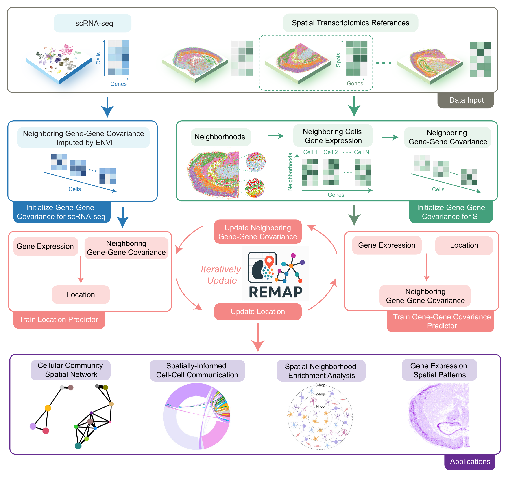

# REMAP

REMAP is a deep learning framework that integrates gene expression with neighborhood-level gene-gene covariance to reconstruct multi-scale spatial organization of scRNA-seq data using one or multiple ST references.



## Installation
For convenience, we recommend creating and activating a dedicated conda environment before installing REMAP. If you haven't installed conda yet, we suggest using [Miniconda](https://www.anaconda.com/docs/getting-started/miniconda/main), a lightweight distribution of conda.

```
conda create -n remap_env python=3.9.19
conda activate remap_env
```
The REMAP repository can be downloaded using:
```
git clone https://github.com/ShunzhouJiang/REMAP
cd remap
```
The remap_env environment can be used in jupyter notebook by:
```
pip install ipykernel
python -m ipykernel install --user --name=remap_env
```

## Dependencies
REMAP is a deep learning based framework, using GPU acceleration can speed up the training process.  If you plan to use a GPU, please make sure that PyTorch is installed with versions that are compatible with your local CUDA version. For example, if you are using CUDA 11.8, you can install the required packages as follows:
```
pip install torch==2.0.0+cu118 torchvision==0.15.1+cu118 torchaudio==2.0.1 --extra-index-url https://download.pytorch.org/whl/cu118
```

All other required packages are listed in [requirements.txt](requirements.txt). You can install them by running:
```
pip install -r requirements.txt
```

## Usage
For detailed usage of REMAP, please check the tutorial for mouse brain analysis: [single slice analysis](Examples/mouse_hd.ipynb), [multiple captures analysis](Examples/mouse_hd_multi.ipynb), and [spatial CAFs identification for human lung cancer](Examples/lung_cancer_cross_subj.ipynb).