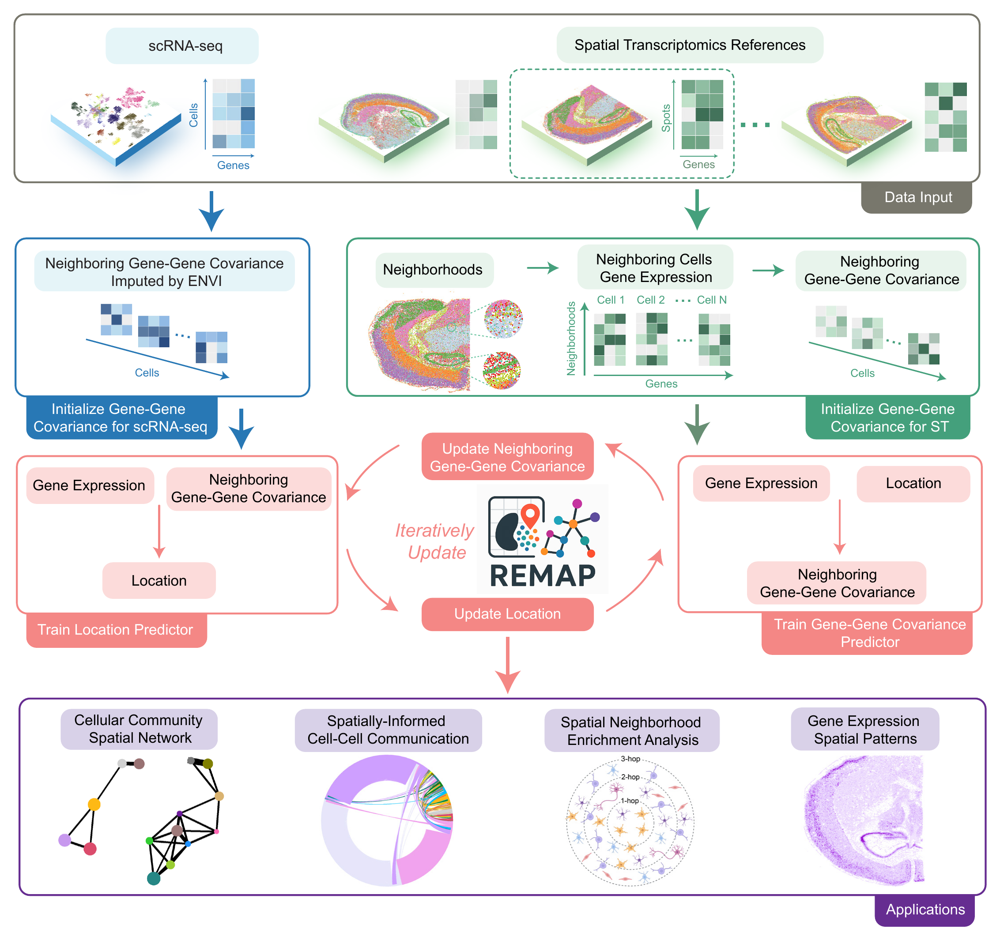

# REMAP

REMAP is a deep learning framework that integrates gene expression with neighborhood-level gene-gene covariance to reconstruct multi-scale spatial organization of scRNA-seq data using one or multiple ST references.



## Installation
For convenience, we recommend creating and activating a dedicated conda environment before installing REMAP. If you haven't installed conda yet, we suggest using [Miniconda](https://www.anaconda.com/docs/getting-started/miniconda/main), a lightweight distribution of conda.

```
conda create -n remap_env python=3.9.19
conda activate remap_env
```
The REMAP repository can be downloaded using:
```
git clone https://github.com/ShunzhouJiang/REMAP
cd remap
```
The remap_env environment can be used in jupyter notebook by:
```
pip install ipykernel
python -m ipykernel install --user --name=remap_env
```

## Dependencies
REMAP is a deep learning based framework, using GPU acceleration can speed up the training process.  If you plan to use a GPU, please make sure that PyTorch is installed with versions that are compatible with your local CUDA version. For example, if you are using CUDA 11.8, you can install the required packages as follows:
```
pip install torch==2.0.0+cu118 torchvision==0.15.1+cu118 torchaudio==2.0.1 --extra-index-url https://download.pytorch.org/whl/cu118
```

All other required packages are listed in [requirements.txt](requirements.txt). You can install them by running:
```
pip install -r requirements.txt
```

## Usage

REMAP runs in two required steps, followed by optional downstream analyses:

```
   ST reference (raw counts + coordinates)          scRNA-seq query (raw counts)
                    |                                          |
                    +------------------+-----------------------+
                                       |
                    Step 1:  covet_init()   --  Initialize neighborhood
                                       |        gene-gene covariance 
                                       |        for the scRNA-seq using ENVI
                    +------------------+-----------------------+
                    |                                          |
        one ST capture                              multiple ST captures
                    |                                          |
   Step 2a: Fit_cord_single()                Step 2b: Fit_cord_multi()
        -> 2D/3D coordinates                      -> pairwise distances 
                    |                                          |
                    +------------------+-----------------------+
                                       |
                    Step 3:  cellular neighborhoods, neighborhood enrichment analysis, ...
```


### Input data

| Object | Requirement | Notes |
| --- | --- | --- |
| `Rdata` (ST reference) | raw counts in `.X` | ENVI models counts directly, so do not pre-normalize |
| | spatial coordinates | passed to step 2 as `location_data`, e.g. `Rdata.obs[['x_cord', 'y_cord']]` |
| | capture source label in `.obs` | **multi-capture only**; the column named by `source_key` to indicate the source origin for each cell (default `"source"`) |
| `Qdata` (scRNA-seq query) | raw counts in `.X` | |
| | cell type/cluster labels in `.obs` | needed for step 3, e.g. `Qdata.obs['Cluster']` |


### Step 1: neighborhood covariance with ENVI

ST cells have real neighbors, so their neighborhood gene-gene covariance (COVET) is
computed directly. Dissociated scRNA-seq cells do not, so COVET is *inferred* for them
with an [ENVI](https://www.nature.com/articles/s41587-024-02193-4) model trained to
bridge the two modalities. 

```python
Rdata, Qdata = remap.covet_init(
    st_data = Rdata, sc_data = Qdata, save_path = path_name,
    num_covet_genes = 100, k_nearest = 100, num_HVG = 1000
)
```

For a multi-capture reference, add `batch_key` so ENVI accounts for the capture effect:

```python
Rdata, Qdata = remap.covet_init(..., batch_key = "source")
```

| Parameter | Default | What it controls |
| --- | --- | --- |
| `st_data`, `sc_data` | — | ST reference and scRNA-seq query, raw counts |
| `save_path` | — | Where the COVET embeddings are cached |
| `num_covet_genes` | `100` | Genes used to build the covariance matrix. |
| `k_nearest` | `100` | Neighbors defining each ST cell's neighborhood |
| `num_HVG` | `1000` | Highly variable genes in scRNA-seq ENVI is trained on |
| `batch_key` | `None` | `.obs` column marking ST captures. **Set this for multi-capture references** |
| `epochs` | `10000` | ENVI training epochs |
| `pve` | `0.98` | Variance kept when PCA-compressing COVET. `False` keeps the full upper triangle instead |

Returns both objects with COVET in `.obsm['covet']`, and caches
`st_covariance.npy` / `sc_covariance.npy` under `save_path`. A later call reuses the
cache, or skips outright if `.obsm['covet']` is already populated.

### Step 2a: single reference capture

With one ST capture there is a single coordinate system to map into, so REMAP predicts
**absolute 2D coordinates** for every query cell. Location and covariance estimates are
refined alternately for `n_iter` rounds.

```python
pred_loc = remap.Fit_cord_single(
    Rdata = Rdata, location_data = Rdata.obs[['x_cord', 'y_cord']],
    Qdata = Qdata, path_name = path_name,
    n_iter = 3, harmony = False,
)
Qdata.obsm['remap'] = pred_loc          # also saved to path_name/remap_loc.npy
```

| Parameter | Default | What it controls |
| --- | --- | --- |
| `location_data` | — | True coordinates of the ST cells, `(n_cells, 2)` |
| `path_name` | — | Output directory for the models and predictions |
| `n_iter` | `3` | Rounds of alternating coordinate / covariance refinement. |
| `harmony` | `True` | Whether run Harmony to correct batch effects between ST and scRNA-seq. Leave on unless the two have already been integrated |

Returns an `(n_query_cells, 2)` array, also written to `path_name/remap_loc.npy`.

### Step 2b: multiple reference captures

Several captures have no common coordinate system, so absolute coordinates are not
meaningful. REMAP instead predicts **pairwise distances** between query cells — enough
for every neighborhood analysis in step 3.

```python
dist_pred = remap.Fit_cord_multi(
    Rdata = Rdata, location_data = Rdata.obs[['x_cord', 'y_cord']],
    Qdata = Qdata, path_name = path_name,
    source_key = "source", equal_size = True,
    full_pairwise = False, neighbor_fraction = 0.1, harmony = True,
)
```

| Parameter | Default | What it controls |
| --- | --- | --- |
| `source_key` | `"source"` | `.obs` column identifying each ST capture |
| `equal_size` | `False` | `True` if the captures cover comparable tissue areas. When `False`, captures are rescaled by their coordinate ranges to match |
| `grid_size` | `200` | Grid resolution for subsampling each capture into training cells |
| `sample_pairs` | `100000` | Cell pairs sampled per capture for training |
| `full_pairwise` | `False` | Predict every cell pair. Leave `False`: the full matrix is quadratic in cells and unnecessary for neighborhood analysis |
| `neighbor_fraction` | `0.1` | With `full_pairwise = False`, the fraction of feature-space neighbors kept per cell |
| `harmony` | `True` | Harmony correction between ST and scRNA-seq |
| `batch_train` / `batch_test` | `1024` / `8192` | Training and prediction batch sizes |
| `predict` | `True` | Set `False` to train only |

Returns the predicted distances and saves them sparsely to
`path_name/remap_rel_dist.npz`, alongside the trained model `remap_rel.pt`.

**Training is skipped when `remap_rel.pt` already exists**, and so is every step that
only exists to build the training set. To reuse a trained model on a new query, call
the same function again, or use `Predict_cord_rel` directly:

```python
dist_pred = remap.Predict_cord_rel(Rdata, Qdata_new, path_name = path_name, full_pairwise = False, 
                                   neighbor_fraction = 0.1)
```

Reload saved distances with `load_npz`; the sparse matrix is used as-is by every
downstream function, with a stored entry meaning "predicted neighbor" and everything
else meaning "too far to matter":

```python
from scipy.sparse import load_npz
dist_pred = load_npz(f"{path_name}/remap_rel_dist.npz")
```

### Step 3: downstream analysis

#### Cellular neighborhoods

```python
Qdata.obs['CN_remap'] = remap.cn_cluster(
    Qdata.obs, loc_matrix = dist_pred,      # or Qdata.obsm['remap']
    ct_key = "Cluster", n_clust = 15, knn = 100,
)
```

| Parameter | Default | What it controls |
| --- | --- | --- |
| `loc_matrix` | — | Predicted coordinates `(n, 2)` or a pairwise distance matrix `(n, n)` |
| `ct_key` | `"Cluster"` | `.obs` column holding cell type labels |
| `n_clust` | `10` | Number of cellular neighborhoods |
| `knn` | `100` | Neighbors whose cell type composition defines each cell's neighborhood |


#### Neighborhood factors (NMF)

Single-capture only — `nmf_main` builds radius-based neighbor graphs and so needs
coordinates in real units, not a distance matrix.

```python
remap.nmf_main(Qdata.obs, spatial = Qdata.obsm['remap'], path = path_name,
               colors = colors, ct_key = "Cluster",
               neighbor_radius = [40, 80, 120], num_factor = 6)
```

| Parameter | Default | What it controls |
| --- | --- | --- |
| `neighbor_radius` | `[40, 80, 120]` | 3-hop Radii, in micron, at which neighborhoods are counted |
| `num_factor` | `6` | Number of NMF factors |
| `ct_interest` | `None` | Restrict the analysis to these cell types |

### Output files

Everything lands under `path_name`:

| File | Written by | Contents |
| --- | --- | --- |
| `st_covariance.npy`, `sc_covariance.npy` | `covet_init` | Cached COVET embeddings |
| `st_harmony.npy`, `sc_harmony.npy` | step 2, when `harmony = True` | Harmony-corrected expression |
| `remap_loc.npy` | `Fit_cord_single` | Predicted query coordinates |
| `remap_rel.pt` | `Fit_cord_multi` | Trained distance model |
| `remap_rel_dist.npz` | `Fit_cord_multi`, `Predict_cord_rel` | Predicted pairwise distances, sparse |

### Tutorials

For the detailed usage of REMAP, please check the [Examples](Examples) folder.
